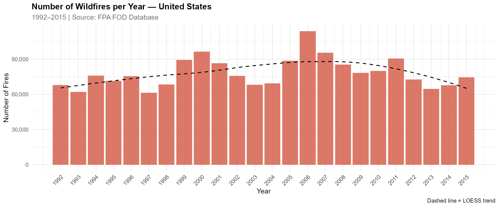
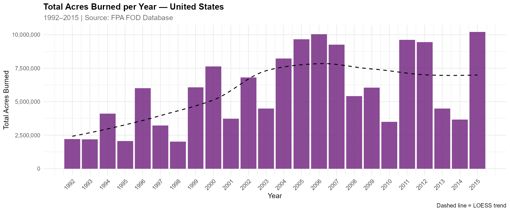
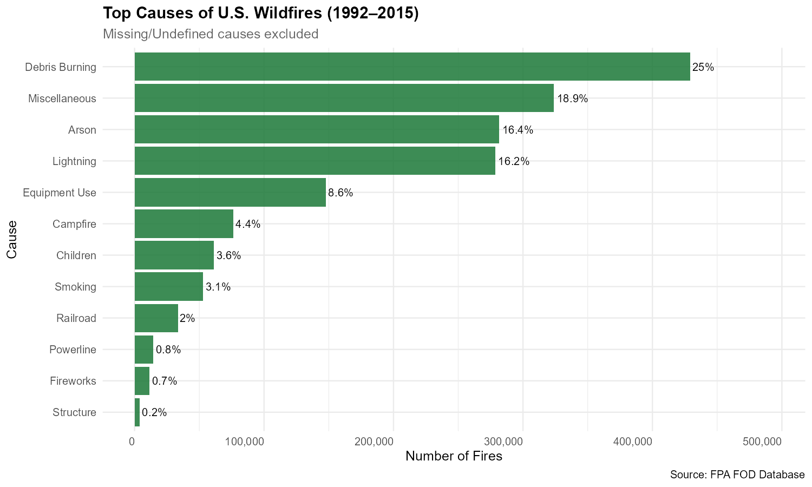
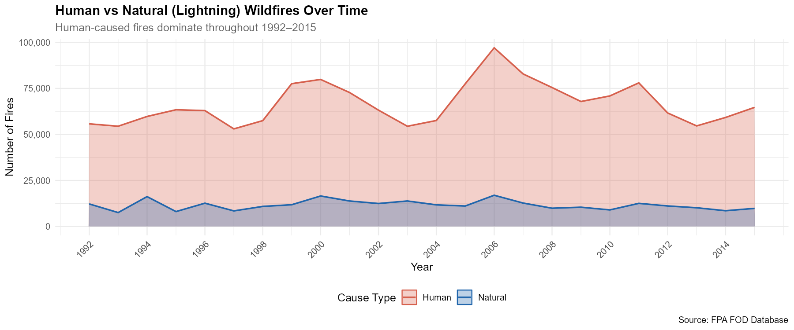
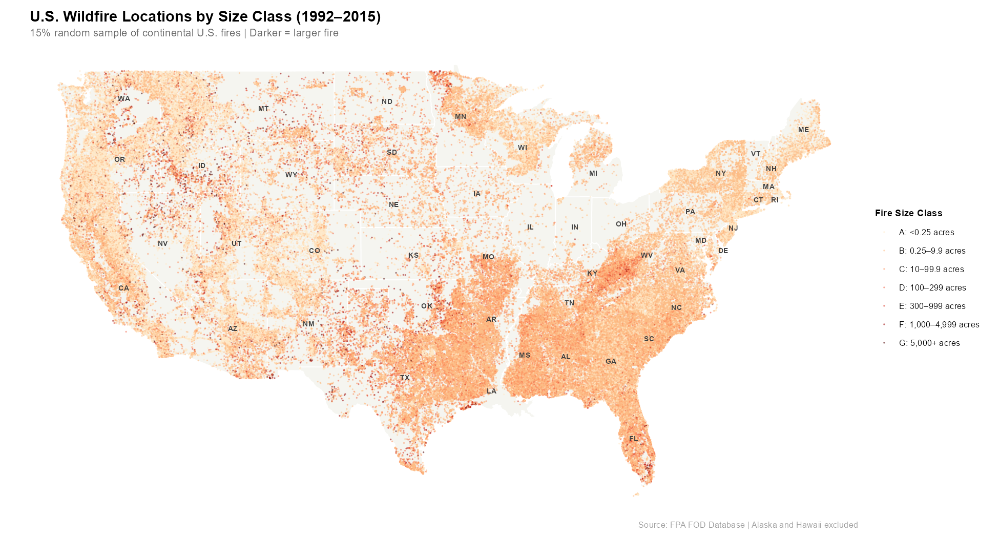
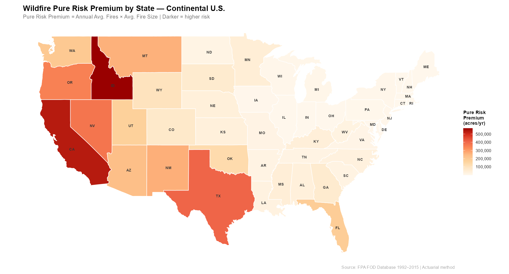
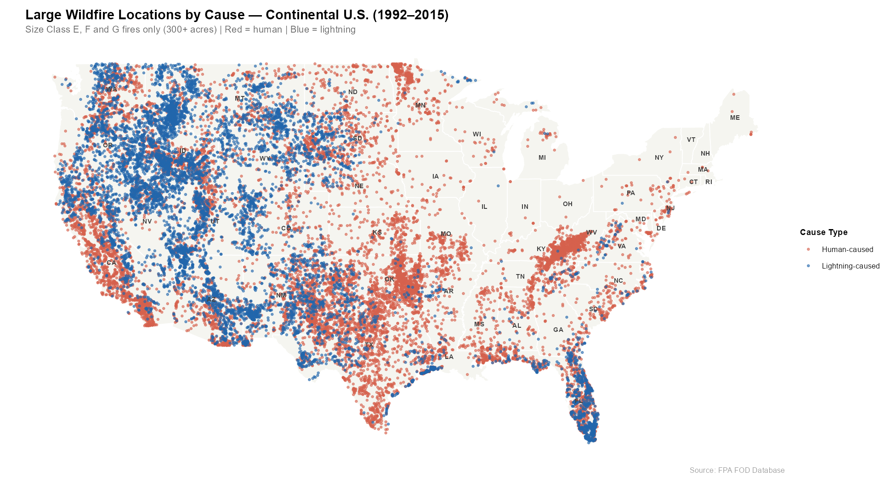
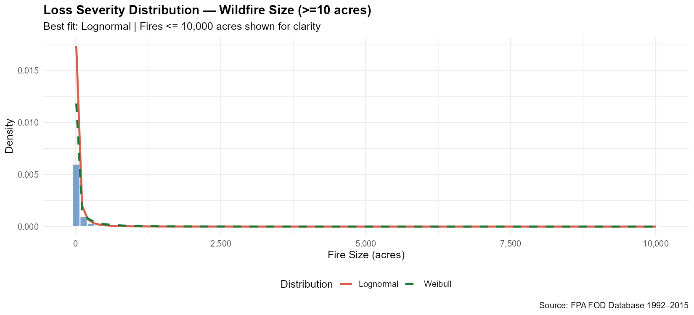
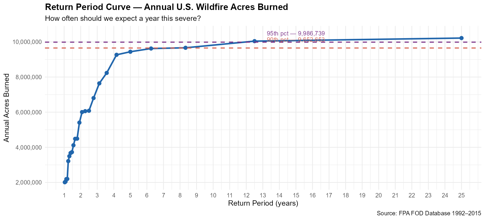
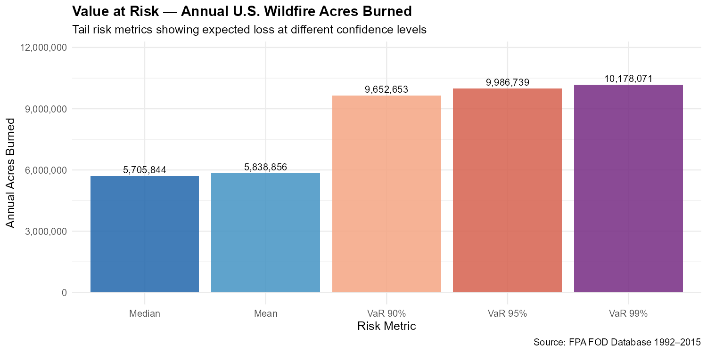

# U.S. Wildfire Risk Analysis (1992–2015)

🔥 **[Launch Interactive Dashboard](https://tagoep.github.io/Wildfire-Analysis/wildfire_dashboard_.html)**

## Overview
This project combines exploratory data analysis and actuarial risk 
methods to analyze 1.88 million U.S. wildfire records from the 
Fire Program Analysis Fire Occurrence Database (FPA FOD). The analysis 
spans frequency trends, geographic patterns, cause attribution, loss 
severity modeling, and state-level risk premium estimation — bridging 
traditional wildfire science with insurance risk analytics.

## Background and Motivation
Wildfires represent one of the fastest-growing natural catastrophe 
perils in the U.S. insurance market. As climate change intensifies 
fire seasons and urban-wildland interface expansion increases exposure, 
accurate risk quantification becomes critical for insurers, reinsurers, 
and public policy makers. This project applies actuarial methods typically used in catastrophe 
modeling — severity distribution fitting, frequency modeling, pure 
risk premium estimation, and Value at Risk — to publicly available 
wildfire data, demonstrating how statistical analysis can inform 
wildfire risk pricing and management.

## Research Questions
1. How have U.S. wildfire frequency and total burn area trended from 
   1992 to 2015?
2. Which states, causes, and seasons drive the greatest wildfire risk?
3. What statistical distributions best describe wildfire loss severity 
   and annual frequency?
4. What is the pure risk premium — expected annual acres burned — 
   by state?
5. What are the return periods and Value at Risk for extreme 
   wildfire years?
6. How do human-caused and lightning-caused fire patterns differ 
   geographically?

## Data
- **Source:** Fire Program Analysis Fire Occurrence Database (FPA FOD)
- **Coverage:** 1992–2015 | 1,880,465 fire records
- **Key variables:** Fire size (acres), cause, state, location 
  (lat/long), discovery date, size class (A–G)
- **Download:** https://www.kaggle.com/datasets/rtatman/188-million-us-wildfires
- **Note:** The raw SQLite file (777MB) is not included in this repo. 
  Download and place in `data/` folder, then run `01_data_extract.R` 
  to generate the cleaned CSV used by all other scripts.

## Methodology

### Exploratory Data Analysis

| Script | Description |
|--------|-------------|
| `01_data_extract.R` | SQLite extraction, cleaning, CSV export |
| `02_eda_trends.R` | EDA — trends, causes, seasonality, state comparisons, human vs lightning |
| `04_map.R` | Spatial maps — fire locations, risk heatmap, cause patterns |

### Actuarial Risk Analysis

| Script | Description |
|--------|-------------|
| `03_actuarial_risk.R` | Severity distribution fitting — Lognormal, Gamma, Weibull |
| | Frequency modeling — Poisson vs Negative Binomial |
| | Pure risk premium estimation by state |
| | Return period curve for extreme fire years |
| | Value at Risk — 90th, 95th and 99th percentiles |

## Key Findings

### Exploratory Findings
- Fire frequency peaked in 2006 (~100,000 fires) and has since 
  declined — but total acres burned has trended upward, indicating 
  fewer but larger fires over time
- 85.5% of all fires are small Class A or B fires (under 10 acres) 
  yet Class G fires (5,000+ acres) account for a disproportionate 
  share of total acres burned
- Debris burning (22.8%) is the single largest cause of wildfires, 
  followed by miscellaneous (17.2%) and arson (15.0%)
- 85.2% of all wildfires are human-caused, only 14.8% are natural 
  lightning ignitions
- Fire activity peaks in spring (March–April) driven by southeastern 
  debris burning, and again in summer (July–August) driven by western 
  lightning fires
- Alaska, Idaho, California, Texas and Nevada have the highest 
  total acres burned over the study period

### Actuarial Findings
- **Loss severity** follows a Lognormal distribution — consistent 
  with industry catastrophe modeling practice — with mean fire size 
  of 503 acres but median of only 27 acres among large fires, 
  reflecting extreme right skew
- **Annual frequency** exhibits severe overdispersion 
  (variance/mean ratio = 2,078), with Negative Binomial outperforming 
  Poisson by a factor of 89 on AIC — indicating wildfire frequency 
  is far more volatile than a stable Poisson process
- **Pure risk premium** analysis reveals Idaho as the highest-risk 
  continental state (570,181 acres/yr) driven by large average fire 
  size, while California ranks third (531,077 acres/yr) driven by 
  extreme frequency — two fundamentally different risk profiles
- **Value at Risk:** A 1-in-10 year event involves ~9.65 million 
  acres burned nationally — nearly double the median annual burn 
  of 5.7 million acres
- **Geographic risk patterns:** Lightning-caused large fires 
  concentrate in the northern Rockies (Idaho, Montana, Wyoming) 
  while human-caused large fires dominate the Southeast and 
  Great Plains — requiring distinct pricing and mitigation strategies

## Model Performance — Severity Distribution Fitting

| Distribution | AIC | BIC | Result |
|-------------|-----|-----|--------|
| **Lognormal** | **3,001,653** | **3,001,674** | **Best fit** |
| Weibull | 3,188,109 | 3,188,130 | Second |
| Gamma | 3,405,182 | 3,405,203 | Third |

## Frequency Distribution Fitting

| Distribution | AIC | BIC | Result |
|-------------|-----|-----|--------|
| **Negative Binomial** | **522** | **525** | **Best fit** |
| Poisson | 46,325 | 46,327 | Poor fit |

## Visualizations

### Fire Frequency Trend (1992–2015)


### Total Acres Burned Per Year


### Top Causes of Wildfires


### Human vs Lightning Fires Over Time


### Fire Locations by Size Class — Continental U.S.


### Wildfire Pure Risk Premium by State


### Large Fire Locations by Cause


### Loss Severity Distribution


### Return Period Curve


### Value at Risk


## Limitations
- Data covers 1992–2015 — does not include the severe post-2015 
  fire seasons in California and the Pacific Northwest
- Fire size (acres burned) is used as a proxy for economic loss — 
  actual insured losses depend on land use, property values, and 
  suppression costs which are not in this dataset
- Pure risk premium is measured in acres per year, conversion to 
  dollar losses requires exposure data not available in FPA FOD
- Alaska excluded from spatial maps due to scale distortion,  
  though Alaska has the highest pure risk premium of any U.S. state
- The 24-year study period captures several drought cycles but may 
  not reflect the accelerating trend driven by post-2015 climate shifts

## Repository Structure
```
wildfire-eda/
├── wildfire_dashboard.html     ← interactive dashboard (live)
├── README.md
├── LICENSE
├── data/
│   ├── fires_sample_10k.csv
│   └── data_source.md
├── scripts/
│   ├── 01_data_extract.R
│   ├── 02_eda_trends.R
│   ├── 03_actuarial_risk.R
│   └── 04_map.R
└── outputs/
    ├── 01–17_*.png
    └── risk_metrics_summary.csv
```

## How to Reproduce
1. Download the FPA FOD SQLite database from the Kaggle link above 
   and place it in the `data/` folder
2. Open RStudio and install required packages:
```r
install.packages(c("DBI", "RSQLite", "readr", "dplyr", "ggplot2",
                   "lubridate", "forcats", "patchwork", "scales",
                   "fitdistrplus", "MASS", "maps"))
```
3. Set working directory to the repo root folder
4. Run scripts in order from `01_data_extract.R` to `04_map.R`
5. All outputs save automatically to the `outputs/` folder

## Future Work
- Extend analysis to post-2015 data to capture recent severe seasons
- Incorporate economic exposure data to convert acres burned into 
  dollar loss estimates
- Build a predictive model for annual fire risk using climate 
  variables (drought index, temperature, precipitation)
- Develop county-level risk premium estimates for granular 
  insurance pricing applications
- Connect findings to spatio-temporal STAR model framework 
  for wildfire forecasting

## Connection to Related Work
This project complements a spatio-temporal analysis of wildfire 
trends in Colorado, Montana, Utah, and Wyoming using STAR models 
and kriging methods, available at 
[ETSU Digital Commons](https://dc.etsu.edu/etd/index.html#year_2026).

## Author
**Princess Tagoe**  
East Tennessee State University  
Research interests: Spatio-temporal analysis | Wildfire risk modeling | 
Actuarial science | Public health data  
[Medium Blog](https://medium.com/@princesstagoe24) 
[Interactive Dashboard](https://tagoep.github.io/Wildfire-Analysis/wildfire_dashboard_.html)
